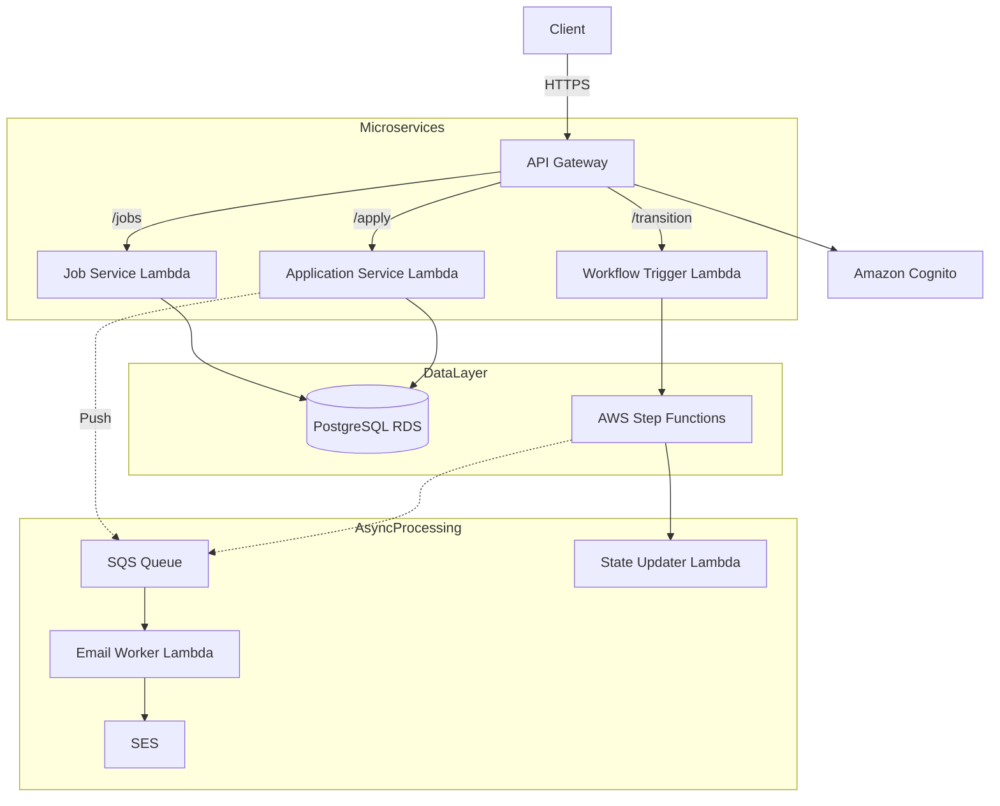
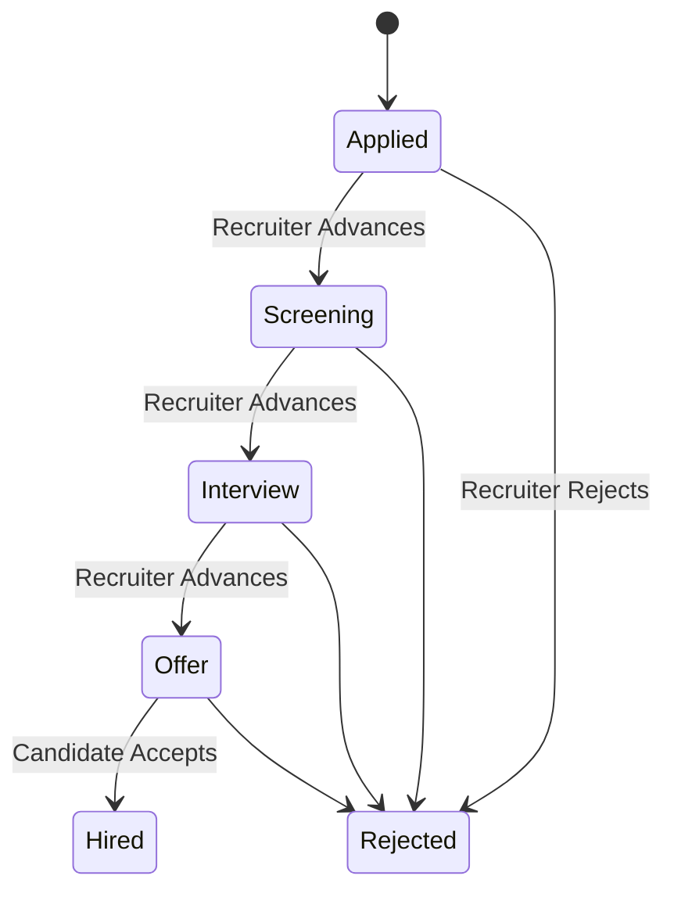
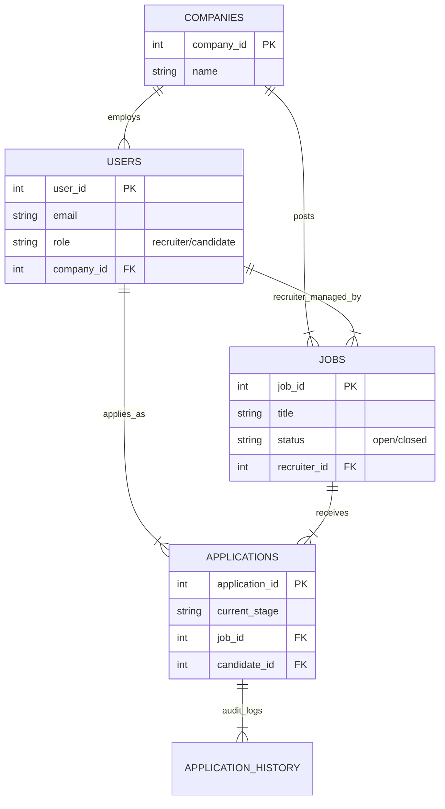

# Serverless Job Application Tracking System (ATS)


A cloud-native, event-driven **Serverless ATS** designed to manage high-volume recruitment workflows.  
Built with AWS Lambda, API Gateway, Cognito, Step Functions, SQS, SES, and PostgreSQL (RDS).  
This system ensures scalable hiring workflows, strict state transitions, background processing, and RBAC-driven access control.

---

## Folder Structure
/serverless-ats
│
├── ats-job-service/
├── ats-application-service/
├── ats-user-sync/
├── ats-workflow-trigger/
├── ats-state-updater/
├── ats-email-worker/
│
├── database/
│   └── schema.sql
│
├── tests/
│
├── Video Demo
└── README.md

---

## Demo & Documentation

🔗 **Video Demo:** `LINK_TO_YOUR_YOUTUBE_VIDEO_HERE`  
🔗 **API Documentation:** `LINK_TO_YOUR_POSTMAN_DOCS_HERE`

---

# Table of Contents

- [Architecture Overview](#️-architecture-overview)
- [Microservices](#-microservices)
- [Workflow & State Machine](#-workflow--state-machine)
- [Role-Based Access Control](#-role-based-access-control)
- [Database Schema](#️-database-schema)
- [Folder Structure](#-folder-structure)
- [Setup & Installation](#️-setup--installation)
- [Deployment Guide](#-deployment-guide)
- [Testing (Postman)](#-testing-postman)
- [Author](#-author)

---

# Architecture Overview

This project follows a fully decoupled **microservices architecture** backed by event-driven messaging.  
The system ensures reliability, fault-tolerance, and high scalability using AWS-managed services.

### High-Level Architecture

1. **Amazon API Gateway** – Entry point for all HTTPS API requests  
2. **Amazon Cognito** – Authentication, JWT issuance, RBAC claims  
3. **AWS Lambda** – Stateless compute for all services  
4. **Amazon RDS (PostgreSQL)** – Primary database  
5. **AWS Step Functions** – Manages candidate lifecycle state transitions  
6. **Amazon SQS + SES** – Asynchronous event queue + email notifications

---

## Microservices

| Microservice | Description |
|--------------|-------------|
| **ATS-Job-Service** | Create, read, update, delete job postings |
| **ATS-Application-Service** | Apply for jobs, view applicants, view application history |
| **ATS-User-Sync** | Sync Cognito users into PostgreSQL automatically |
| **ATS-Workflow-Trigger** | Initiates Step Function for candidate workflow |
| **ATS-State-Updater** | Updates database records when state transitions happen |
| **ATS-Email-Worker** | Sends emails asynchronously via SQS + SES |

---

## Data Flow Diagram



## Workflow & State Management
The application lifecycle is strictly enforced by AWS Step Functions. This prevents invalid state transitions (e.g., moving a candidate from "Applied" directly to "Hired" without an interview).

### Valid States: Applied → Screening → Interview → Offer → Hired



## Role-Based Access Control (RBAC)

Security is implemented at both:
- **API Gateway level** (Authorizers)
- **Lambda level** (Business Logic Validation)

---

### **Endpoint Permissions**

| Endpoint                         | Method        | Recruiter Role | Candidate Role | Description                               |
|----------------------------------|---------------|----------------|----------------|-------------------------------------------|
| `/jobs`                          | POST          | ✅              | ❌              | Post a new job opening                    |
| `/jobs/{id}`                     | PUT / DELETE  | ✅              | ❌              | Edit or remove a job                      |
| `/jobs`                          | GET           | ✅              | ✅              | View all open jobs                        |
| `/apply`                         | POST          | ❌              | ✅              | Submit a new application                  |
| `/my-applications`               | GET           | ❌              | ✅              | View own application history              |
| `/job-applications`              | GET           | ✅              | ❌              | View all candidates for a job             |
| `/applications/{id}/transition`  | POST          | ✅              | ❌              | Advance a candidate's stage               |

## Database Schema (ERD)

The system relies on a normalized **PostgreSQL** schema hosted on **Amazon RDS**.



## Setup & Installation

---

### **1. Prerequisites**
- **Node.js v20.x** installed locally  
- **AWS Account** (Free Tier recommended)  
- **PostgreSQL Client** (e.g., DBeaver) for database initialization  

---

### **2. Environment Variables**

Every Lambda function requires the following environment variables to be set in the AWS Console:

```bash
DB_HOST=ats-db.xxxx.us-east-1.rds.amazonaws.com
DB_USER=postgres
DB_PASSWORD=YOUR_SECURE_PASSWORD
DB_NAME=postgres
QUEUE_URL=https://sqs.us-east-1.amazonaws.com/YOUR_ACCOUNT/ats-email-queue
STATE_MACHINE_ARN=arn:aws:states:us-east-1:xxxx:stateMachine:ATS-Application-Workflow
```

### 3. Database Initialization

Run the SQL script located at:


This will create all necessary tables and constraints for the ATS system.

---

### 4. Running the Project

Since this is a **Serverless project**, there is no single "server" to start.

#### **Deploy Microservices**
Zip and upload each microservice folder (e.g., `ats-job-service`, `ats-application-service`, etc.) to its corresponding **AWS Lambda** function.

#### **Configure API Gateway**
Map all routes as defined in the **Architecture** section.

#### **Verify Deployment**
Use the included **Postman Collection** to hit the API Gateway endpoint and test functionality.

---

## Testing (Postman)

A complete Postman collection is included:


### **How to Test**

1. Import the collection into Postman  
2. Get a **Recruiter Token** via the `/login` Cognito login flow  
3. Create a job → `POST /jobs`  
4. Get a **Candidate Token**  
5. Apply for the job → `POST /apply`  
6. Switch back to **Recruiter** and trigger the workflow → `POST /transition`  
7. **Verify**: Check your email for the asynchronous notification  

---

### **Built by Sameer Sayyad**
